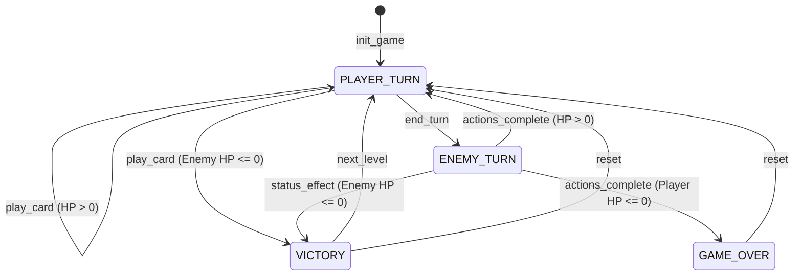

# 游戏有限状态机 (FSM) 设计

本项目核心逻辑由确定性有限自动机 (DFA) 驱动，状态转移集中在 `GameManager` 中。

## 状态定义

| 状态 | 说明 |
| :--- | :--- |
| `PLAYER_TURN` | 玩家回合。可以进行出牌 (`play_card`) 或结束回合 (`end_turn`)。 |
| `ENEMY_TURN` | 敌人回合。系统自动处理状态结算和敌人 AI 行动，完成后自动切回玩家回合。 |
| `VICTORY` | 战斗胜利。当敌人 HP 归零时进入。可选择进入下一关 (`next_level`)。 |
| `GAME_OVER` | 游戏失败。当玩家 HP 归零时进入。可重置游戏 (`reset`)。 |

## 状态转移图 (Mermaid)

## 确定性输入 (DFA 行为)

- **play_card(card)**: 
    - `(PLAYER_TURN, card)` -> `PLAYER_TURN` (if Enemy HP > 0)
    - `(PLAYER_TURN, card)` -> `VICTORY` (if Enemy HP <= 0)
- **end_turn()**:
    - `(PLAYER_TURN)` -> `ENEMY_TURN`
- **enemy_act() / status_check**:
    - `(ENEMY_TURN)` -> `PLAYER_TURN` (if Player HP > 0)
    - `(ENEMY_TURN)` -> `GAME_OVER` (if Player HP <= 0)
- **next_level()**:
    - `(VICTORY)` -> `PLAYER_TURN` (Load new enemy)
